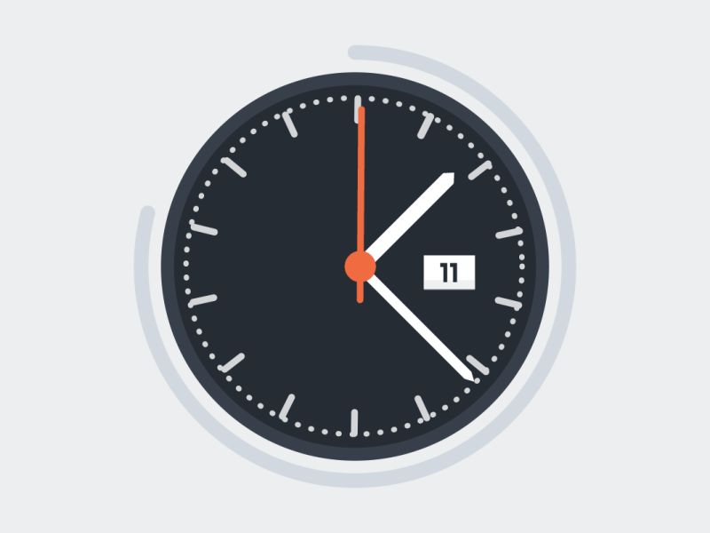

  

 
   

<h1 align="center">Hi 👋, Saya Yafet Purnama</h1>
<h3 align="center">Full Stack Developer | Web Designer | IT Analyst</h3>

 

<table>
<tr>
<td valign="top" width="60%">

### 👨‍💻 Tentang Saya

<!-- <li>🙋‍♂️ Semua tentang saya di <a href="https://portfolio-update-yafet.vercel.app/" target="_blank" rel="noopener noreferrer"><strong>Portofolioku</strong></a></li> -->

- 🙋‍♂️ Semua tentang saya di <a href="https://portfolio-yafetpurnama.vercel.app/" target="_blank" rel="noopener noreferrer"><strong>Portofolioku</strong></a></li>
- 🔭 Saat ini sedang mengerjakan: <strong>[Projek Freelance]</strong>
- 🌱 Sedang mendalami: <strong>[Go-Lang]</strong> & <strong>[Cybersecurity]</strong>
- 👯 Terbuka untuk kolaborasi di: <strong>[Proyek Open Source]</strong>
- 💬 Ajak saya diskusi tentang: <strong>React, Next.js, Laravel</strong>
- 📫 Hubungi saya di: <strong>joshuapurnama123@gmail.com</strong>
- ⚡ Fakta menarik: <strong>Selalu mencoba dan pantang menyerah</strong>

</td>
<td valign="top" width="40%">
  

    
  

</td>
</tr>
</table>

 

### 🛠️ Keahlian & Teknologi yang Saya Kuasai:

    
    
    
    
    
    
    
    
    
    

 

### 📊 Statistik GitHub Saya

  

    
  

  

    
  

 

### 🤝 Terhubung dengan Saya

  
  
  

