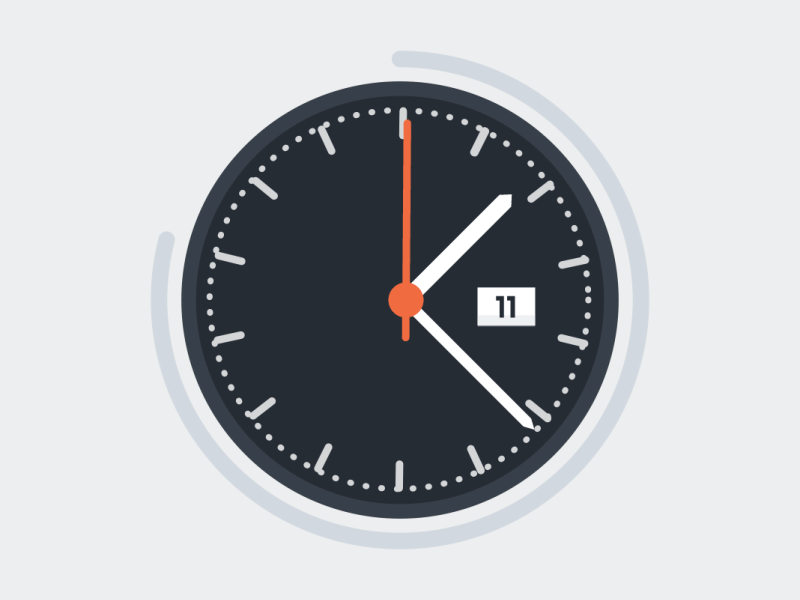

  

  

<h1 align="center">Hi 👋, Saya Yafet Purnama</h1>
<h3 align="center">Full Stack Developer | Web Designer | IT Analyst</h3>

<table>
<tr>
<td valign="top" width="65%">
<ul>
  <li>🔭 Saat ini saya sedang mengerjakan <strong>[Projek Freelance]</strong></li>
  <li>🌱 Saat ini saya sedang mendalami <strong>[Go-Lang]</strong></li>
  <li>👯 Saya mencari kolaborasi untuk <strong>[Meningkatkan Kemampuan saya]</strong></li>
  <li>🤔 Saya membutuhkan bantuan terkait <strong>[Ide ide dan pengembangan yang kreatif]</strong></li>
  <li>💬 Tanya saya tentang <strong>React, Next.js, atau Laravel</strong></li>
  <li>📫 Cara menghubungi saya: <strong>joshuapurnama123@gmail.com</strong></li>
  <li>⚡ Fakta menarik: <strong>[Selalu mencoba dan pantang menyerah]</strong></li>
</ul>
</td>
<td valign="top" width="35%" align="center">
  
</td>
</tr>
</table>

 

<h3 align="left">Keahlian & Teknologi yang Saya Kuasai:</h3>

    
    
    
    
    
    
    
    
    
    

 

<h3 align="left">Statistik GitHub Saya:</h3>

  

  

 

<h3 align="left">Hubungi Saya:</h3>

